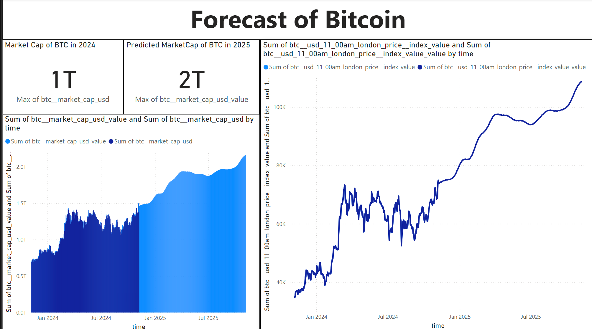
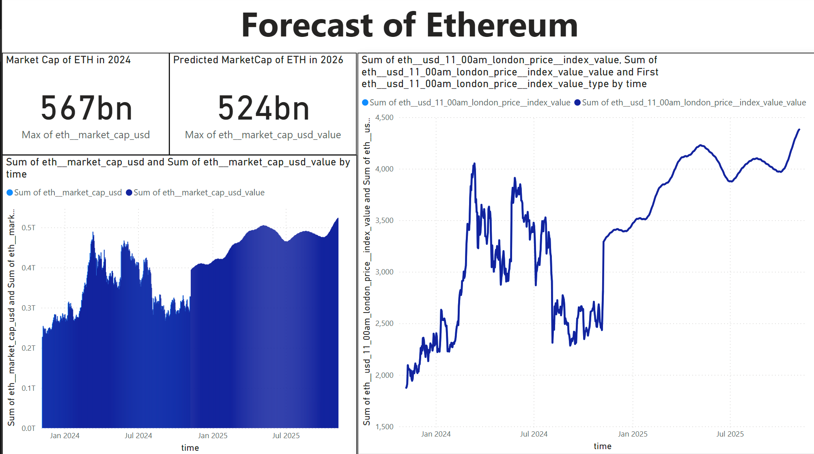
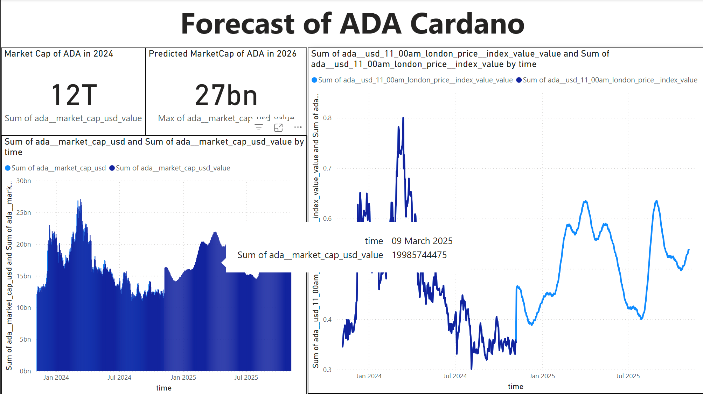

# Cryptocurrency Market Forecasting with Prophet

This project uses advanced predictive modeling techniques to analyze and forecast the cryptocurrency market trends. Leveraging Facebook's Prophet library, historical data, and advanced visualizations, the project provides actionable insights into cryptocurrency price trends and market dynamics.

## Table of Contents
- [Project Overview](#project-overview)
- [Files in the Repository](#files-in-the-repository)
- [Key Features](#key-features)
- [Methodology](#methodology)
- [Dependencies](#dependencies)
- [Usage Instructions](#usage-instructions)
- [Results and Findings](#results-and-findings)
- [Acknowledgments](#acknowledgments)

## Project Overview
The cryptocurrency market has witnessed exponential growth, evolving from a niche technology to a mainstream financial asset. This project focuses on analyzing historical cryptocurrency data, exploring trends, and forecasting future trajectories using statistical models and visualizations.

## Files in the Repository
- **CryptoForecast.ipynb**: Jupyter Notebook detailing data preprocessing, modeling, and visualizations.
- **prophet_historical_and_next_year.csv**: CSV file containing historical data and forecasted results.
- **CryptoForecasts.pbix**: Power BI file with interactive visualizations and dashboards.


## Key Features
- Historical data analysis of major cryptocurrencies (Bitcoin, Ethereum, etc.).
- Predictive modeling with Facebook's Prophet library.
- Interactive dashboards created using Power BI.
- Visualizations of price trends, market capitalization, and correlation matrices.
- Insights into market dynamics and the influence of external factors on cryptocurrency prices.

## Methodology
1. **Data Collection**: Sourced data from CoinMetrics and CoinMarketCap.
2. **Data Preparation**: Cleaned, transformed, and standardized data using Python libraries like Pandas and NumPy.
3. **Visualization**: Created visualizations using Matplotlib, Seaborn, and Power BI.
4. **Forecasting**: Developed predictive models using Prophet to identify trends and project future price trajectories.

## Dependencies
To replicate this project, ensure you have the following:
- Python 3.7 or later
- Libraries: pandas, numpy, matplotlib, seaborn, fbprophet
- Power BI for interactive dashboard visualization
- Jupyter Notebook for running and exploring the analysis

## Usage Instructions
1. Clone the repository:
   ```bash
   git clone https://github.com/your-username/cryptocurrency-forecasting.git
   ```
2. Install the required Python libraries:
   ```bash
   pip install pandas numpy matplotlib seaborn fbprophet
   ```
3. Open the Jupyter Notebook:
   ```bash
   jupyter notebook CryptoForecast.ipynb
   ```
4. Load the Power BI file (`CryptoForecasts.pbix`) to explore interactive dashboards.

## Results and Findings
- Significant inverse correlation observed between Bitcoin prices and Federal Reserve rates.
- Dominance of Bitcoin and Ethereum in market capitalization.
- Stablecoins (USDT, USDC) showcased consistent value and liquidity contributions.
- Predictive analysis highlighted periodic market cycles influenced by macroeconomic events.

## Dashboards



---